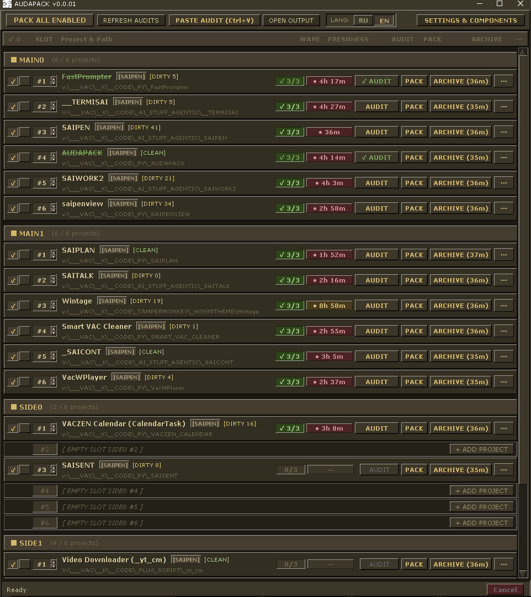

# AUDAPACK

<p align="center">
  
</p>

<p align="center"><strong>Рабочее место Windows для проверенной упаковки ZIP, многоэтапного AI-аудита и локального браузерного моста.</strong></p>

<p align="center">
  <a href="CHANGELOG.md"></a>
  <a href="https://www.python.org/"></a>
  
  <a href="tests/"></a>
  <a href="tests/widget/"></a>
</p>

<p align="center"><a href="README.md">English</a> · <a href="README.ru.md"><strong>Русский</strong></a></p>



## Назначение

AUDAPACK объединяет проекты, аудиторские материалы и готовые архивы в одном компактном рабочем пространстве Windows. Основной интерфейс — Qt; Tkinter сохранён как явный запасной вариант.

- **Проверенная упаковка ZIP** — атомарный `.part`-стейджинг, проверка CRC, обязательные исключения, манифесты, хранение истории и читаемый размер архива.
- **Project Room** — 24 канонических слота в группах `MAIN0`, `MAIN1`, `SIDE0`, `SIDE1`; при необходимости поддерживаются дополнительные группы.
- **Кампании Quick3 и Super10** — профили аудита с динамическими волнами, изоляцией запусков, проверкой lineage и каноническими итоговыми handoff-файлами.
- **Локальный Bridge** — HTTP-сервис на `127.0.0.1:17843`; текущий API — v3, совместимость с API v2 сохранена.
- **Tampermonkey-виджет** — отправляет волны аудита из ChatGPT, восстанавливает прерванные запуски и связывает кампанию с собственным `runId`.
- **Надёжный INAUDIT Inbox** — сохраняет стабильные ответы ChatGPT, отдельные блоки или текст буфера до выбора проекта, а затем назначает исходный текст в следующий безопасный слой `audit/N.md`.
- **Интеграция Windows** — контекстное меню Проводника, тихие VBScript-лаунчеры, передача файлов через буфер и Scheduled Task для Bridge.
- **Golden Vintage UI** — тёмная эстетика Windows 95, компактные рельефные элементы и намеренно чёткий текст без сглаживания.

## Установка

AUDAPACK рассчитан на Windows и требует Python 3.10 или новее. Установка приложения с Qt-интерфейсом и инструментами разработки:

```powershell
python -m pip install -e ".[qt,dev]"
```

Для установки только окружения выполнения используйте `.[qt]`. PySide6 не является обязательной зависимостью пакета, но нужен для интерфейса Qt по умолчанию.

## Запуск

Для тихого запуска GUI дважды щёлкните `AUDAPACK.vbs` или запустите точку входа напрямую:

```powershell
python AUDAPACK.pyw
```

Qt используется по умолчанию. Старый интерфейс Tkinter запускается явно:

```powershell
python AUDAPACK.pyw --ui tkinter
```

Браузерную часть установите отдельно: добавьте `resources/AUDAPACK_WIDGET.user.js` в Tampermonkey и откройте ChatGPT. При работающем Bridge виджет подключится к локальному сервису.

Для автономных аудитов используйте **Settings → Components → Launch AUDAPACK Chromium**. AUDAPACK выбирает установленный Chromium-браузер (Chrome, Cent, Edge, Vivaldi или Opera раньше Brave), запускает его в отдельном профиле `%LOCALAPPDATA%\AUDAPACK\browser_worker` и отключает Chromium-throttling таймеров, перекрытых окон и renderer-процессов. В этом выделенном профиле нужно один раз установить Tampermonkey и виджет. Worker продолжает работу при свёрнутом окне, поверх других приложений и при выключенных экранах; сон или гибернация Windows всё равно останавливают все процессы, поэтому для автономного запуска их нужно отдельно отключить.

## Project Room

В каждой занятой строке проекта могут отображаться прогресс аудита, его возраст, свежесть архива, размер ZIP, счётчики копирования и состояние упаковки. Размер ZIP показывается в двоичных единицах (`B`, `KB`, `MB`, `GB`, `TB`) и обновляется после упаковки. В режиме **Full** подробности ZIP находятся во второй строке; включите **Settings → General → Compact project rows**, чтобы оставить основные данные и размер в одной строке.

Основные действия проекта:

- `E` — включить или исключить проект из упаковки.
- `✓` — отметить проект завершённым и приглушить его в комнате.
- `A` — пропустить проект при массовой упаковке.
- `PACK` — создать или обновить архив проекта.
- `PACK ALL` — упаковать включённые проекты в порядке слотов.
- `COPY AUDIT` — скопировать канонический handoff аудита.
- `COPY ZIP` — передать ZIP-файл в буфер обмена Windows.
- `ⓘ` — открыть полную информацию о проекте, аудите, архиве и кампании.

Архивы можно хранить в одной папке, рядом с проектами или в подпапках приоритетных групп. Настройка находится в **Settings → Packing**.

## Браузерный аудит

Виджет поддерживает два канонических профиля:

- **Quick3** — стандартный аудит из трёх волн: Core, Second и Performance.
- **Super10** — глубокий аудит из десяти волн с синтезом кампании и итоговым handoff для реализации.

Bridge проверяет авторизацию, идентичность проекта и запуска, манифест профиля, порядок волн и признаки завершения перед записью файлов. После сбоя виджет восстанавливает сохранённое состояние и не подменяет один запуск другим.

Новый аудит может забрать только чистая корневая вкладка ChatGPT в Chromium-браузере. Вкладки с существующим диалогом, черновиком, вложением, генерацией или некорневым URL закрыты для выдачи заданий.

## Сбор материалов INAUDIT

У стабильного ответа ChatGPT нажмите `IA` рядом со всем ответом или отдельным блоком. Подтверждённая запись Bridge показывает `IA ✓`; если Bridge недоступен, ограниченная очередь IndexedDB показывает `IA QUEUED` и позднее повторяет отправку с тем же идентификатором. В AUDAPACK откройте **INAUDIT → Inbox**, проверьте происхождение и доказательства классификации, выберите зарегистрированный проект и нажмите **Assign**, **Assign + GG** или **Assign + CC**. Кнопка `IA+` на панели сохраняет текущий буфер Windows через то же надёжное хранилище.

При назначении AUDAPACK заново сканирует `audit`, создаёт `max(N) + 1` без перезаписи, сверяет хеш тела и только после этого предлагает каноническую команду GG/CC.

## Справка по командной строке

```text
usage: AUDAPACK.pyw [-h] [--pack PATH] [--pack-project ID] [--silent]
                    [--install-context-menu] [--remove-context-menu]
                    [--status] [--paste] [--ingest PATH_OR_TEXT] [--bridge]
                    [--takeover-legacy-bridge] [--install-autostart]
                    [--remove-autostart] [--repair-autostart]
                    [--ui {qt,tkinter}]

options:
  -h, --help              Показать эту справку и выйти
  --pack PATH             Упаковать папку или файл в архив
  --pack-project ID       Упаковать зарегистрированный проект по ID
  --silent                Тихо упаковать все включённые проекты
  --install-context-menu  Установить пункт в контекстное меню Проводника
  --remove-context-menu   Удалить пункт из контекстного меню Проводника
  --status                Вывести статус реестра и аудита
  --paste                 Принять волны аудита из буфера Windows
  --ingest PATH_OR_TEXT   Принять волны из файла или текста
  --bridge                Запустить Bridge в foreground-режиме
  --takeover-legacy-bridge
                          Выполнить транзакционный takeover старого Bridge
  --install-autostart     Установить Scheduled Task AUDAPACK Bridge
  --remove-autostart      Удалить Scheduled Task AUDAPACK Bridge
  --repair-autostart      Восстановить Scheduled Task AUDAPACK Bridge
  --ui {qt,tkinter}       Выбрать GUI: Qt (по умолчанию) или Tkinter
```

Примеры:

```powershell
python AUDAPACK.pyw --pack "C:\Projects\Demo"
python AUDAPACK.pyw --pack-project AUDAPACK
python AUDAPACK.pyw --silent
python AUDAPACK.pyw --status
python AUDAPACK.pyw --bridge
```

## Тесты и lint

```powershell
python -m pytest -q
ruff check audapack tests
Get-ChildItem tests/widget -Filter *.test.js | ForEach-Object { node $_.FullName }
```

Текущая база: **365 тестов Python** и **152 Node-теста виджета**.

## Карта репозитория

```text
AUDAPACK/
├── audapack/
│   ├── bridge/             # Авторизованный loopback Bridge и хранилище
│   ├── components/         # Виджет, миграции и интеграция Windows
│   ├── services/           # Сервисы приложения, аудита, проектов и упаковки
│   ├── ui_qt/              # Основной Project Room на PySide6
│   ├── ui/                 # Запасной интерфейс Tkinter
│   ├── audits.py           # Индексация аудита и снимки состояния
│   ├── campaign.py         # Движок кампаний Quick3/Super10
│   ├── config.py           # Конфигурация и миграции
│   ├── ingest.py           # Проверяемый транзакционный ingest
│   ├── packing.py          # Атомарное создание и поиск ZIP
│   └── projects.py         # Реестр проектов и слоты
├── docs/wiki/              # Архитектура, кампании, UI и CLI
├── resources/              # Виджет, иконки и скриншот Project Room
├── tests/                  # Регрессионные тесты Python и Node
├── AUDAPACK.pyw            # Основная точка входа
├── AUDAPACK.vbs            # Тихий запуск GUI
├── PACK_ALL_SILENT.vbs     # Тихая массовая упаковка
├── CHANGELOG.md            # История релизов
├── README.md               # Документация на английском
├── README.ru.md            # Документация на русском
└── VERSION                 # Каноническая версия
```

## Документация

- [Главная Wiki](docs/wiki/Home.md)
- [Архитектура и Bridge](docs/wiki/Architecture-and-Bridge.md)
- [Движок кампаний аудита](docs/wiki/Audit-Campaign-Engine.md)
- [Конвейер Auto3](docs/wiki/Auto3-Audit-Pipeline.md)
- [CLI и тихая упаковка](docs/wiki/CLI-and-Silent-Packaging.md)
- [Интерфейс Golden Vintage](docs/wiki/UI-Golden-Vintage.md)
- [Регрессионные наборы виджета](tests/widget/README.md)
- [История изменений](CHANGELOG.md)

## Гарантии безопасности

- Архив создаётся во временном `.part`-файле, проверяется и только затем атомарно публикуется.
- Неполный или повреждённый архив не заменяет предыдущий исправный архив.
- Bridge слушает только loopback и требует токен авторизации вне дерева проекта.
- Запись аудита выполняется через транзакционные снимки и сообщает об ошибках сохранения честно.
- Обязательные исключения не позволяют упаковывать секреты, runtime-состояние, кэши и вложенные архивы.
