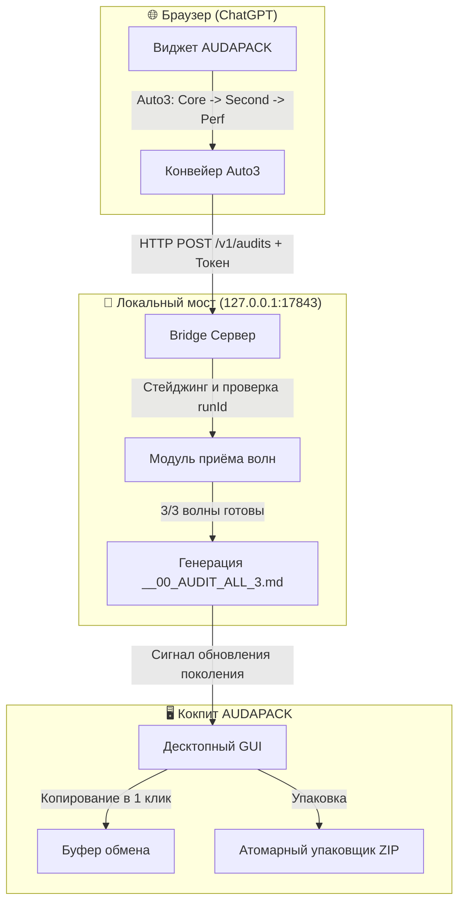

# AUDAPACK

<p align="center">
  
</p>

<p align="center">
  <b>Высокоскоростная упаковка проектов, аудит-кокпит и мост автоматизации браузера для Windows</b>
</p>

<p align="center">
  <a href="CHANGELOG.md"></a>
  <a href="https://www.python.org/"></a>
  
  <a href="tests/"></a>
  <a href="resources/AUDAPACK_WIDGET.user.js"></a>
  <a href="docs/wiki/UI-Golden-Vintage.md"></a>
</p>

<p align="center">
  <b><a href="README.md">English</a></b> • <b><a href="README.ru.md">Русский</a></b>
</p>

---

<p align="center">
  
</p>

---

## ⚡ Главные возможности

- **📦 Чистая упаковка проектов**: Создание проверенных `.zip` архивов с временным `.part` файлом, проверкой CRC, фильтрацией исключений и манифестом.
- **🎛️ Приоритетный кокпит на 24 слота**: Структурированная сетка из четырёх канонических групп (`MAIN0`, `MAIN1`, `SIDE0`, `SIDE1`) по 6 слотов.
- **⏱️ Отслеживание свежести в реальном времени**: Цветовые индикаторы температуры аудита (`HOT`, `WARM`, `COOL`, `COLD`, `STALE`) с точным прошедшим временем.
- **📋 Копирование аудита в 1 клик**: Мгновенное копирование `__00_AUDIT_ALL_3.md` в буфер, отслеживание хэша и переключение `✓ АУДИТ` / `АУДИТ`.
- **🌐 Браузерная автоматизация Auto3**: Встроенный Tampermonkey скрипт (`AUDAPACK_WIDGET.user.js`) для сквозного аудита в 3 волны в ChatGPT с изоляцией `runId`.
- **🔌 Локальный демон-мост**: Высокоскоростной HTTP сервер на `127.0.0.1:17843` (API v2) с токен-авторизацией и атомарной сборкой волн.
- **🪟 Интеграция с Windows**: Контекстное меню Проводника (*«Упаковать через AUDAPACK»*) и фоновые VBScript-лаунчеры без консоли.
- **🎨 Эстетика Golden Vintage**: Классическая тёмно-золотая тема Windows 95 с 2px рельефными фасками и нулевым сглаживанием шрифтов (No AA).

---

## 🧭 Структура колонок интерфейса

Рабочее пространство организовано в виде компактной высококонтрастной сетки:

| Колонка | Заголовок | Описание | Взаимодействие |
|:---|:---|:---|:---|
| **0** | `✓ ⊘` | Чекбоксы включения и визуального приглушения | Включение в сборку или затемнение строки |
| **1** | `СЛОТ` | Номер слота (`#1`–`#6`) | Позиция проекта и ручка перетаскивания |
| **2** | `Проект и путь` | Название, статус Git, бейдж SAIPEN, путь на диске | Правый клик по имени сбрасывает статус копирования |
| **3** | `ВОЛНА` | Готовность аудита (`✓ 3/3`, `2/3`, `1/3`, `0/3`) | Статус завершения текущих волн |
| **4** | `СВЕЖЕСТЬ` | Индикатор температуры (`● 14m`, `● 3h`, `● 8h`, `—`) | Цветовой индикатор давности аудита |
| **5** | `АУДИТ` | Кнопка копирования готового аудита | Копирует `__00_AUDIT_ALL_3.md` в буфер обмена |
| **6** | `СБОРКА` | Кнопка мгновенной упаковки (`ПАК`) | Создаёт датированный `.zip` архив проекта |
| **7** | `АРХИВ` | Кнопка копирования файла архива (`АРХИВ (14m)`) | Копирует `.zip` архив прямо в буфер Проводника |
| **8** | `···` | Меню слота проекта | Перемещение, изменение, папка, удаление |

---

## 🏗️ Архитектура и поток данных



---

## 🚀 Быстрый старт

### 1. Запуск интерфейса
Двойной клик по `AUDAPACK.vbs` (тихий запуск без консоли) или:
```cmd
pythonw AUDAPACK.pyw
```

### 2. Фоновая упаковка всех проектов
Двойной клик по `PACK_ALL_SILENT.vbs` или:
```cmd
pythonw AUDAPACK.pyw --silent
```

### 3. Интеграция в контекстное меню
Установите интеграцию из окна **Настройки** или командой:
```cmd
python AUDAPACK.pyw --install-context-menu
```
*Нажмите правой кнопкой мыши по любой папке или файлу в Проводнике и выберите **Упаковать через AUDAPACK**.*

### 4. Установка браузерного виджета
Откройте Tampermonkey в браузере и установите скрипт `resources/AUDAPACK_WIDGET.user.js`. При открытии ChatGPT панель AUDAPACK появится прямо над полем ввода.

---

## 🌡️ Матрица свежести и температур

Температура аудита рассчитывается автоматически по метаданным времени (`GENERATED_AT` / `DATE_TIME`) из файлов аудита:

| Маркер | Состояние | Порог времени | Цветовой тон |
|:---:|:---|:---|:---|
| `●` | **HOT** | `0` – `4 часа` | Ярко-коралловый (`#D49090` на `#451B1B`) |
| `●` | **WARM** | `>4` – `24 часа` | Тёплый золотой (`#D4B875` на `#3E3014`) |
| `●` | **COOL** | `>1` – `3 дня` | Прохладный синий (`#8BB4D4` на `#182E40`) |
| `❄️` | **COLD** | `>3` – `7 дней` | Холодный серый (`#A0A8B0` на `#20242B`) |
| `○` | **STALE** | `>7 дней` | Устаревший тёмный (`#7D7565` на `#221E18`) |
| `—` | **NONE** | *Аудит отсутствует* | Приглушённый прочерк (`#6E674E`) |

---

## 💻 Справка по консольным командам

```text
usage: AUDAPACK.pyw [-h] [--pack PATH] [--pack-project ID] [--silent]
                    [--install-context-menu] [--remove-context-menu]
                    [--status] [--bridge]

options:
  -h, --help              Показать эту справку и выйти
  --pack PATH             Упаковать указанную папку или файл в архив
  --pack-project ID       Упаковать зарегистрированный проект по ID
  --silent                Упаковать все активные проекты в тихом режиме
  --install-context-menu  Установить пункт в контекстное меню Проводника
  --remove-context-menu   Удалить пункт из контекстного меню Проводника
  --status                Вывести статус реестра и свежести в stdout
  --bridge                Запустить сервер моста в консоли
```

---

## 📁 Структура репозитория

```text
_AUDAPACK/
├── audapack/               # Основной пакет приложения
│   ├── bridge/             # Локальный HTTP демон (API v2) и хранилище волн
│   ├── components/         # Планировщик задач, автозапуск и миграции
│   ├── services/           # Нейтральные сервисы бизнес-логики
│   ├── ui/                 # Десктопный интерфейс Tkinter (Golden Default)
│   ├── ui_qt/              # Реализация десктопного интерфейса PySide6 Qt
│   ├── config.py           # Конфигурация и сериализатор JSON
│   ├── packing.py          # Атомарный упаковщик ZIP со стейджингом .part
│   └── projects.py         # Реестр 24 слотов и приоритетные группы
├── docs/                   # Документация и Wiki для разработчиков
│   └── wiki/               # Полная база знаний из 5 разделов
├── resources/              # Брендовые ассеты, иконки и виджет
│   ├── AUDAPACK_WIDGET.user.js # Пользовательский скрипт автоматизации
│   ├── app_icon.ico        # Мульти-размерная иконка приложения Windows
│   ├── app_icon.png        # Иконка приложения Golden Vintage
│   └── screenshot.png      # Высококачественный скриншот кокпита
├── scripts/                # Скрипты бенчмаркинга и тестирования
├── tests/                  # Наборы тестов Pytest и Node.js виджета
│   ├── services/           # Модульные тесты сервисов
│   ├── ui/                 # Тесты моделей и интерфейса
│   └── widget/             # 86 тестов браузерного виджета на Node.js
├── AUDAPACK.pyw            # Основная точка входа GUI
├── AUDAPACK.vbs            # Тихий лаунчер GUI
├── PACK_ALL_SILENT.vbs     # Тихий лаунчер пакетной упаковки
├── CHANGELOG.md            # История версий и изменений
├── README.md               # Документация на английском языке
├── README.ru.md            # Документация на русском языке
└── VERSION                 # Каноническая версия релиза
```

---

## 📚 База знаний и Wiki

Подробные технические руководства доступны в каталоге [`docs/wiki/`](docs/wiki/):
- 🏠 **[Главная Wiki](docs/wiki/Home.md)** — Обзор и начало работы.
- 🔌 **[Архитектура и демон моста](docs/wiki/Architecture-and-Bridge.md)** — Эндпоинты HTTP и изоляция безопасности.
- 🤖 **[Автоматизация Auto3](docs/wiki/Auto3-Audit-Pipeline.md)** — 3-волновой аудит и логика виджета.
- 🎨 **[Стиль Golden Vintage](docs/wiki/UI-Golden-Vintage.md)** — Токены Win95 палитры и правила No AA.
- 📦 **[Консоль и тихая упаковка](docs/wiki/CLI-and-Silent-Packaging.md)** — Автоматизация и сценарии сборки.

---

## 🔒 Инварианты и безопасность

- **Атомарный стейджинг**: Архивы сначала пишутся во временный `.part` файл, валидируются через `zipfile.testzip()` и только затем замещают целевой архив.
- **Безопасный мост**: HTTP сервер привязан исключительно к `127.0.0.1`, требует 256-битный токен авторизации из `%LOCALAPPDATA%` (не попадает в репозиторий) и ограничивает размер входящих запросов.
- **Строгая изоляция RunId**: Этапы аудита привязаны к идентификатору сессии, что исключает показ чужих или устаревших волн.
- **Без сторонних фреймворков**: Базовый функционал работает на стандартной библиотеке Python без облачных зависимостей и телеметрии.

---

<p align="center">
  <b>AUDAPACK</b> — Скорость, наглядность и надёжность.
</p>

